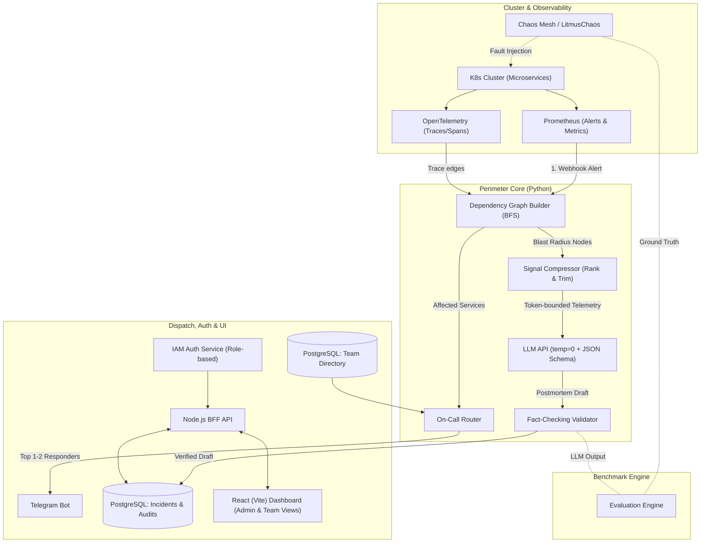

# Project Perimeter: Technical Architecture & 45-Day Engineering Roadmap

## Overview
Perimeter is a self-hosted, data-sovereign Kubernetes incident correlation and smart paging engine designed to replace expensive, SaaS-only incident AI tools (e.g., PagerDuty Advance, Datadog Watchdog) for compliance-bound environments (BFSI, government, healthcare).

Instead of guessing causality from arbitrary time windows or black-box ML, Perimeter deterministically walks OpenTelemetry trace edges via BFS to bound the incident blast radius, ranks and compresses telemetry under token budgets, produces a fact-checked LLM root-cause draft, and routes targeted Telegram pages to the right engineers based on skills, seniority, and leave status.



---

## System Architecture & Technical Specifications

### 1. The 90-Second Incident Lifecycle
1. **Trigger (`T+00s`)**: Prometheus alertmanager fires an alert webhook on an unhealthy service (e.g., `checkout-service` P95 latency > 2s).
2. **Blast Radius Discovery (`T+02s`)**: The Dependency Graph Builder initiates BFS outward on active OpenTelemetry trace edges to isolate the exact causal topology (e.g. `checkout-service` → `payment-gateway` → `inventory-service`), filtering out unrelated noisy services.
3. **Signal Ranking & Compression (`T+04s`)**: The Signal Compressor scores logs, metrics, and trace spans based on causal proximity and anomaly severity, selecting the top candidates within a strict token budget (~40 items).
4. **Root-Cause Hypothesis & Fact Check (`T+07s`)**: LLM generates a structured JSON root-cause diagnosis. The deterministic Fact-Checking Validator cross-examines entity mentions against the source telemetry context to eliminate hallucinations.
5. **Smart Routing (`T+08s`)**: In parallel, the On-Call Router matches affected services to the Team Directory, selecting a balanced responder pair (e.g., 1 Senior SRE owner + 1 Junior engineer on call, filtering out members on leave) and dispatches alert cards via Telegram.
6. **Dashboard Verification (`T+55s`)**: Responder logs into the role-scoped React dashboard, reviews the pre-drafted postmortem alongside raw trace evidence, approves/edits, and marks the incident resolved.

### 2. IAM & Security Model
- **Admin Role (5-digit ID)**: Complete cluster visibility, cross-service inspection, team directory management, and leave tracking.
- **Team Member Role (6-digit ID)**: Scoped visibility; users inspect only services and incidents owned by their team.
- **Constant-time / Generic Auth Errors**: Server-side role resolution on every request; non-existent and invalid credentials receive identical generic error responses to prevent user enumeration.

### 3. Verification & Evaluation Engine
- **Chaos Fault Harness**: Chaos Mesh injects known synthetic faults (latency, pod kills, packet drops).
- **Ground-Truth Benchmarking**: The evaluation engine compares Perimeter's generated root-cause hypothesis against the exact injected chaos experiment parameters to calculate a deterministic accuracy score.

---

## 45-Day Engineering Roadmap

```mermaid
gantt
    title 45-Day Project Perimeter Delivery Plan
    dateFormat X
    axisFormat Day %s
    
    section Sprint 1 (Days 1-5)
    Full Team Kickoff & Scaffolding     :active, s1, 1, 5d
    
    section Sprint 2 (Days 6-18)
    Track 1: BFS Graph & Signal Compressor :s2a, after s1, 13d
    Track 2: IAM, BFF API & Dashboard Scaffolding :s2b, after s1, 13d
    Track 3: Minikube, OTel/Prometheus & Chaos Harness :s2c, after s1, 13d
    
    section Sprint 3 (Days 19-30)
    Cross-Track Integration & Telegram Dispatch :s3a, 19, 12d
    End-to-End Incident Pipeline Wireup :s3b, 22, 9d
    
    section Sprint 4 (Days 31-40)
    Chaos Fault Injection & Accuracy Benchmarking :s4a, 31, 10d
    Role-Based Dashboard Polish & Audit Logging :s4b, 31, 10d
    
    section Final Sprint (Days 41-45)
    Full E2E Demo & Production Showcase :s5a, 41, 5d
    Technical Report & Capstone Deliverables :s5b, 41, 5d
```

### Sprint 1: Scaffolding & Shared Foundations (Days 1 – 5)
* **Goal**: Establish the monorepo, Docker Compose local test bed, and core database schemas.
* **Deliverables**:
  - PostgreSQL schema for IAM (Admin vs Team Member), Team Directory, Services, and Incidents.
  - Base monorepo setup: Python environment, Node.js BFF, React (Vite) frontend.
  - Mock OTel trace and Prometheus alert generator for headless unit testing.

### Sprint 2: Core Module Primary Build (Days 6 – 18)
* **Track 1: Correlation & Signal Intelligence**:
  - Dependency Graph Builder: Ingest OTel spans, build directed graph, implement BFS outward blast radius scoping.
  - Signal Compressor & LLM Engine: Metric/log ranking algorithm, JSON schema prompt builder, and hallucination fact-checker.
* **Track 2: IAM, BFF API & Dispatch**:
  - IAM Auth Service & Node BFF: 5-digit/6-digit server-side role resolution, incident REST endpoints.
  - Team Directory & On-Call Routing Engine: Scoring algorithm for skill/seniority/leave + Telegram Bot client.
* **Track 3: Cluster Infrastructure & Chaos Harness**:
  - Cluster Infrastructure: Minikube dev setup, Helm manifests for OTel Collector, Prometheus, Grafana, and mock microservices.
  - Chaos Harness: Chaos Mesh installation, automated fault injection scripts (latency injection on mock services).

### Sprint 3: Cross-Track Integration & Pipeline Wire-Up (Days 19 – 30)
* **Integration Focus**: Connect individual microservices into a unified event-driven pipeline.
* **Key Milestones**:
  - **By Day 24**: First end-to-end alert pipeline running: Alert → BFS blast radius → Compression → LLM postmortem draft.
  - **By Day 28**: On-Call Telegram bot pings mock responder with generated incident summary.
  - **By Day 30**: React dashboard visualizes the blast-radius dependency graph and pre-drafted postmortem with role-based restrictions.

### Sprint 4: Chaos Testing & Ground-Truth Benchmarking (Days 31 – 40)
* **Evaluation Engine**:
  - Inject automated chaos scenarios (network latency, CPU throttle, pod crashes).
  - Run evaluation engine to benchmark LLM postmortem accuracy against ground-truth chaos configurations.
* **Security & Reliability Hardening**:
  - Penetration test Admin vs Team Member access to confirm zero data leakage between unrelated service teams.
  - Performance profiling: Ensure alert-to-dashboard latency is consistently under 90 seconds.

### Sprint 5: Final Demo, Showcase & Project Deliverables (Days 41 – 45)
* **Deployment**: Spin up staging window to capture production-grade demo recordings and metrics.
* **Deliverables**:
  - Live interactive demo script (running synthetic incident live on Minikube/EKS).
  - Benchmark accuracy results write-up.
  - Capstone project report & presentation deck.

---

## Repository Layout (Target)

```
Perimeter/
├── project_architecture_and_roadmap.md  # Master architectural roadmap & timeline
├── services/
│   ├── correlation-engine/              # Python: BFS Graph, Signal Compressor, LLM Integration
│   │   ├── src/
│   │   │   ├── graph/                   # OTel trace BFS traversal
│   │   │   ├── compressor/              # Signal ranking & token budgeting
│   │   │   ├── llm/                     # Prompt templates & fact-checking validator
│   │   │   └── router/                  # On-call matching logic
│   │   ├── tests/
│   │   ├── Dockerfile
│   │   └── pyproject.toml / requirements.txt
│   ├── bff-server/                      # Node.js: API Gateway, IAM validation, Webhook receiver
│   │   ├── src/
│   │   │   ├── auth/                    # 5-digit / 6-digit authorization
│   │   │   ├── incidents/               # Incident state management
│   │   │   └── bot/                     # Telegram Bot API integration
│   │   └── package.json
│   └── dashboard/                       # React (Vite) + Tailwind UI
│       ├── src/
│       │   ├── components/              # Blast-radius graph visualizer, Incident editor
│       │   ├── views/                   # Admin view (5-digit) vs Team view (6-digit)
│       │   └── ...
├── evaluation/
│   ├── chaos/                           # Chaos Mesh experiment definitions
│   └── benchmark/                       # Automated accuracy scoring harness
├── deploy/
│   ├── docker-compose.yml               # Local offline dev environment
│   ├── k8s/                             # Helm charts & manifests
│   └── terraform/                       # Infrastructure as Code
└── docs/                                # Diagrams, schemas, and capstone documentation
```

---

## Quality Assurance & Verification Strategy

### Planned Automated Testing
- `pytest services/correlation-engine/tests/`: Verify BFS graph traversal bounds, cycle handling, compression token limits, and validator rejection of hallucinated entities.
- `npm test --prefix services/bff-server`: Verify IAM role security (role enforcement and constant error messaging).
- `python evaluation/benchmark/run_benchmark.py`: Execute evaluation suite against injected chaos experiments.

### End-to-End Validation Workflow
1. Run local environment via `docker-compose up`.
2. Inject synthetic latency into `payment-gateway` via chaos harness script.
3. Observe Prometheus alert triggering Perimeter correlation pipeline.
4. Verify Telegram dispatch arrives with appropriate responder tags based on service ownership and leave status.
5. Verify Admin (5-digit) accesses full cluster incident details; Team member (6-digit) only accesses incident details if their team owns the affected service.
